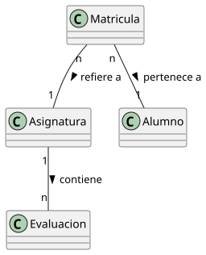

# Hash Sample - Sistema de Gestión de Actas Académicas

Un sistema de gestión de actas académicas desarrollado en Java que implementa un mecanismo de verificación de integridad mediante hash personalizado para prevenir la manipulación de registros académicos.

## 🎯 Características Principales

- **Gestión de Estudiantes**: Registro y administración de datos de alumnos
- **Sistema de Evaluaciones**: Soporte para múltiples evaluaciones con pesos ponderados
- **Cálculo de Notas Finales**: Cálculo automático basado en evaluaciones ponderadas
- **Generación de Actas**: Creación de actas académicas oficiales
- **Verificación de Integridad**: Sistema de hash personalizado para prevenir manipulación
- **Interfaz de Consola**: Salida colorizada para mejor visualización

## 📁 Estructura del Proyecto

```
hashSample/
├── src/
│   ├── Simulacion.java          # Clase principal de demostración
│   ├── entidades/               # Entidades del dominio
│   │   ├── Acta.java           # Acta académica con verificación hash
│   │   ├── Alumno.java         # Estudiante
│   │   ├── Asignatura.java     # Asignatura/Materia
│   │   ├── Evaluacion.java     # Evaluación con peso ponderado
│   │   ├── Matricula.java      # Matrícula del estudiante
│   │   └── Acta-HashPropuesto.md # Documentación del algoritmo hash
│   └── utils/
│       └── Console.java        # Utilidades para salida en consola
├── modelosUML/
│   └── DdC.puml               # Diagrama de clases en PlantUML
├── images/
│   └── modelosUML/
│       └── DdC.svg            # Diagrama de clases en formato SVG
└── README.md                  # Este archivo
```

## 🚀 Compilación y Ejecución

### Requisitos Previos
- Java Development Kit (JDK) 8 o superior
- Compilador javac

### Compilación
```bash
# Compilar todas las clases
javac -d . src/Simulacion.java src/entidades/*.java src/utils/*.java
```

### Ejecución
```bash
# Ejecutar la simulación
java Simulacion
```

## 💡 Ejemplo de Uso

El programa principal (`Simulacion.java`) demuestra el uso completo del sistema:

```java
// Crear evaluaciones con pesos ponderados
Evaluacion[] evaluaciones = {
    new Evaluacion("Examen Parcial", 0.25),
    new Evaluacion("Evaluación Continua", 0.20),
    new Evaluacion("Examen Final", 0.50),
    new Evaluacion("Nota del Profesor", 0.05)
};

// Crear asignatura
Asignatura eda2 = new Asignatura("EDA2", "Estructura de Datos y Algoritmos II", 6, evaluaciones);

// Crear estudiantes
Alumno alumno1 = new Alumno("Ana", "García", "12345678A");

// Crear matrícula con calificaciones
double[] calificaciones = { 8.5, 7.0, 9.0, 10.0 };
Matricula matricula = new Matricula(alumno1, eda2, calificaciones);

// Cerrar asignatura y generar acta
eda2.cerrarAsignatura();
Acta acta = new Acta(eda2, new Matricula[]{matricula});

// Verificar integridad
boolean integridadOk = acta.verificarIntegridad();
```

## 🔐 Sistema de Verificación Hash

El sistema implementa un algoritmo de hash personalizado para garantizar la integridad de las actas académicas:

### Algoritmo de Hash
1. **Primera letra del nombre** de cada alumno
2. **Primera letra del apellido** de cada alumno
3. **Último carácter del DNI** de cada alumno
4. **Notas finales redondeadas** concatenadas
5. **Estado de aprobación**: "1" para aprobado, "0" para suspenso
6. **Código de la asignatura**
7. **Primera letra del nombre de la asignatura**
8. **Número de créditos**
9. **Año y mes** de la fecha de generación

### Cifrado
- Desplazamiento de 3 posiciones en la tabla ASCII para cada carácter
- Ejemplo: 'A' (ASCII 65) → 'D' (ASCII 68)

### Verificación
```java
boolean integridadOk = acta.verificarIntegridad();
// Retorna true si el acta no ha sido manipulada
```

## 🏛️ Arquitectura del Sistema

### Entidades Principales

- **Alumno**: Representa un estudiante con nombre, apellido y DNI
- **Asignatura**: Materia con código, nombre, créditos y evaluaciones
- **Evaluacion**: Tipo de evaluación con peso ponderado
- **Matricula**: Relación entre alumno y asignatura con calificaciones
- **Acta**: Documento oficial con verificación de integridad

### Diagrama de Clases



El diagrama muestra las relaciones entre las entidades:
- Una Asignatura contiene múltiples Evaluaciones
- Una Matricula pertenece a un Alumno y refiere a una Asignatura
- El Acta se genera a partir de múltiples Matrículas

## 📊 Salida del Sistema

### Información de Asignatura
```
INFORMACIÓN DE ASIGNATURA 
Asignatura: Estructura de Datos y Algoritmos II (Código: EDA2, Créditos: 6)
```

### Evaluaciones
```
EVALUACIONES
- Examen Parcial (25.0%)
- Evaluación Continua (20.0%)
- Examen Final (50.0%)
- Nota del Profesor (5.0%)
```

### Acta Generada
```
ACTA DE LA ASIGNATURA: Estructura de Datos y Algoritmos II (EDA2)
Créditos: 6
Fecha: 2025-07-16
Hash de verificación: DFHGJPUODEFG<7<84344HGD5H95358:

DNI          | NOMBRE                          | NOTA FINAL | ESTADO
-------------|----------------------------------|------------|--------
12345678A    | García, Ana                      | 8.53       | APROBADO
23456789B    | Martínez, Carlos                 | 3.55       | SUSPENSO
34567890C    | Rodríguez, Elena                 | 8.90       | APROBADO
45678901D    | López, David                     | 5.05       | APROBADO
```

### Verificación de Integridad
```
VERIFICANDO INTEGRIDAD DEL ACTA
✅ El acta no ha sido manipulada
```

## 🔧 Funcionalidades Técnicas

### Colores en Consola
- **Verde**: Notas aprobatorias y estados de aprobado
- **Rojo**: Notas suspensos y estados de suspenso
- **Cyan**: Contenido del acta
- **Blanco sobre negro**: Encabezados de secciones

### Validaciones
- Verificación de asignatura cerrada antes de generar acta
- Cálculo automático de estado de aprobación (nota ≥ 5.0)
- Validación de integridad mediante hash

### Características del Hash
- **Inmutable**: Una vez generado, cualquier cambio es detectado
- **Determinístico**: El mismo conjunto de datos produce el mismo hash
- **Sensible**: Cualquier modificación mínima cambia el hash completamente

## 🛠️ Tecnologías Utilizadas

- **Java 8+**: Lenguaje de programación principal
- **PlantUML**: Generación de diagramas UML
- **ANSI Escape Codes**: Colorización de salida en consola

## 📈 Posibles Mejoras

- Persistencia en base de datos
- Interfaz gráfica de usuario
- Exportación a PDF
- Validación de DNI español
- Soporte para múltiples idiomas
- API REST para integración

## 🤝 Contribución

Este proyecto es parte de un sistema educativo para demostrar conceptos de:
- Programación orientada a objetos
- Verificación de integridad
- Sistemas de gestión académica
- Algoritmos de hash personalizados

## 📄 Licencia

Este proyecto es de uso educativo y académico.